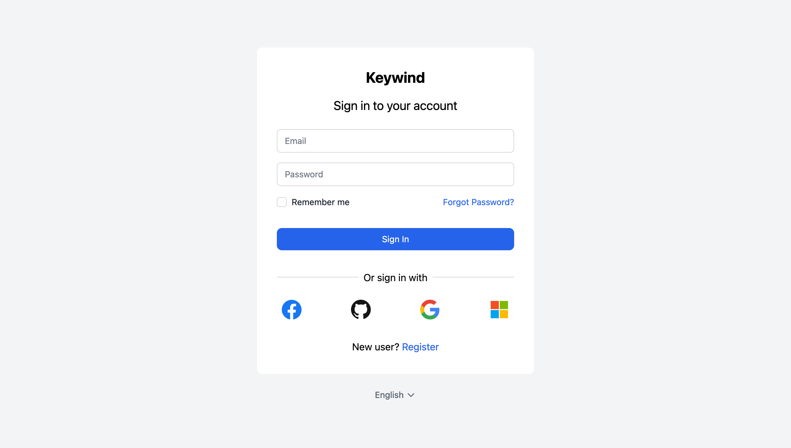

# :wind_face: Keywind

Keywind is a component-based Keycloak Login Theme built with [Tailwind CSS](https://github.com/tailwindlabs/tailwindcss) and [Alpine.js](https://github.com/alpinejs/alpine).



### Styled Pages

- Login
- Login Config TOTP
- Login IDP Link Confirm
- Login OAuth Grant
- Login OTP
- Login Reset Password
- Login Update Password
- Login Update Profile
- Logout Confirm
- Register

### Identity Provider Icons

- Bitbucket
- Facebook
- GitHub
- GitLab
- Google
- Instagram
- LinkedIn
- Microsoft
- OpenID
- Red Hat OpenShift
- PayPal
- Stack Overflow
- Twitter

## Installation

Keywind has been designed with component-based architecture from the start, and **you can customize as little or as much Keywind as you need**:

1. [Deploy Keywind Login Theme](https://www.keycloak.org/docs/latest/server_development/#deploying-themes)
2. [Create your own Login Theme](https://www.keycloak.org/docs/latest/server_development/#creating-a-theme)
3. Specify parent theme in [theme properties](https://www.keycloak.org/docs/latest/server_development/#theme-properties):

```
parent=keywind
```

4. Brand and customize components with [FreeMaker](https://freemarker.apache.org/docs/dgui_quickstart_template.html)

## Customization

### Theme

When you do need to customize a palette, you can configure your colors under the `colors` key in the `theme` section of `tailwind.config.js` file:

```js
// tailwind.config.js
module.exports = {
  theme: {
    extend: {
      colors: {
        primary: colors.red,
      },
    },
  },
};
```

Read more about Tailwind CSS configuration in the [documentation](https://tailwindcss.com/docs/configuration).

### Components

You can inherit Keywind components in your own theme. For example, to resize the primary button you should create a styled `theme/mytheme/components/button/primary.ftl` file:

```
<#macro kw component="button" rest...>
  <${component}
    class="bg-primary-600 flex justify-center px-6 py-3 relative rounded-lg text-md text-white w-full focus:outline-none focus:ring-2 focus:ring-primary-600 focus:ring-offset-2 hover:bg-primary-700"
    <#list rest as attrName, attrValue>
      ${attrName}="${attrValue}"
    </#list>
  >
    <#nested>
  </${component}>
</#macro>
```

## Build

When you're ready to deploy your own theme, run the build command to generate a static production build.

```bash
pnpm install
pnpm build
```
