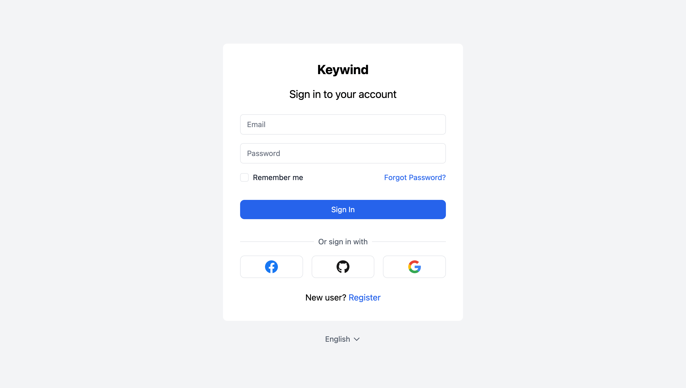
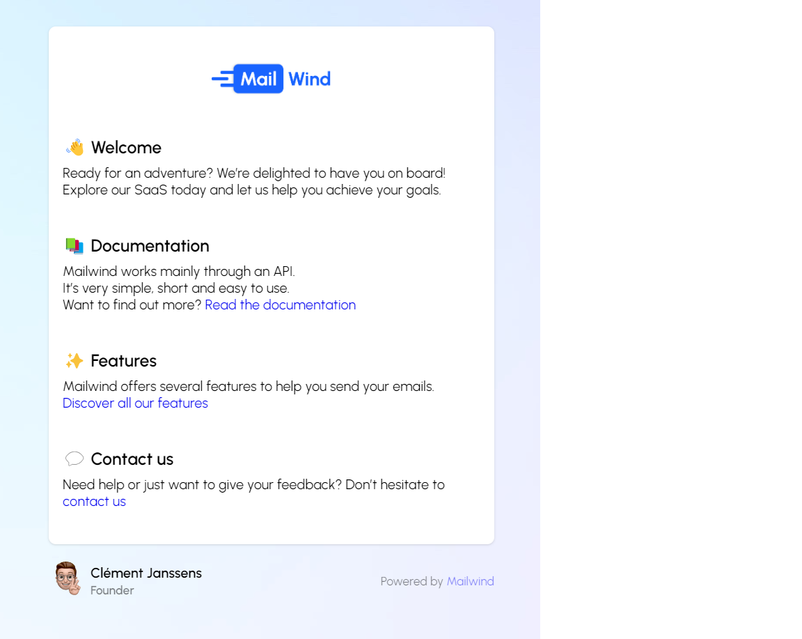

# :wind_face: Keywind

Keywind is a component-based Keycloak Login & E-Mail Theme built with [Tailwind CSS](https://github.com/tailwindlabs/tailwindcss), [Mailwind](https://www.mailwind.io/) and [Alpine.js](https://github.com/alpinejs/alpine).





### Styled Pages

- Error
- Login
- Login Config TOTP
- Login IDP Link Confirm
- Login OAuth Grant
- Login OTP
- Login Page Expired
- Login Password
- Login Recovery Authn Code Config
- Login Recovery Authn Code Input
- Login Reset Password
- Login Update Password
- Login Update Profile
- Login Username
- Logout Confirm
- Register
- Select Authenticator
- Terms and Conditions
- WebAuthn Authenticate
- WebAuthn Error
- WebAuthn Register

### Identity Provider Icons

- Apple
- Bitbucket
- Discord
- Facebook
- GitHub
- GitLab
- Google
- Instagram
- LinkedIn
- Microsoft
- OpenID
- Red Hat OpenShift
- PayPal
- Slack
- Stack Overflow
- Twitter

### Styled Pages

- Error
- Login
- Login Config TOTP
- Login IDP Link Confirm
- Login OAuth Grant
- Login OTP
- Login Page Expired
- Login Password
- Login Recovery Authn Code Config
- Login Recovery Authn Code Input
- Login Reset Password
- Login Update Password
- Login Update Profile
- Login Username
- Login X.509 Info
- Logout Confirm
- Register
- Select Authenticator
- Terms and Conditions
- WebAuthn Authenticate
- WebAuthn Error
- WebAuthn Register

### Identity Provider Icons

- Apple
- Bitbucket
- Discord
- Facebook
- GitHub
- GitLab
- Google
- Instagram
- LinkedIn
- Microsoft
- OpenID
- Red Hat OpenShift
- PayPal
- Slack
- Stack Overflow
- Twitter

## Installation

Keywind has been designed with component-based architecture from the start, and **you can customize as little or as much Keywind as you need**:

1. [Deploy Keywind Themes](https://www.keycloak.org/docs/latest/server_development/#deploying-themes)
2. [Create your own Themes](https://www.keycloak.org/docs/latest/server_development/#creating-a-theme)
3. Specify parent theme in [theme properties](https://www.keycloak.org/docs/latest/server_development/#theme-properties):

```
parent=keywind
```

4. Brand and customize components with [FreeMarker](https://freemarker.apache.org/docs/dgui_quickstart_template.html)

## Customization

### Theme

When you do need to customize a palette, you can configure your colors under the `colors` key in the `theme` section of Tailwind config file:

`tailwind.config.js`

```js
module.exports = {
  theme: {
    extend: {
      colors: {
        primary: colors.red,
      },
    },
  },
};
```

Read more about Tailwind CSS configuration in the [documentation](https://tailwindcss.com/docs/configuration).

### Components

You can update Keywind components in your own child theme. For example, create a copy of the `body` component and change the background:

`theme/mytheme/login/components/atoms/body.ftl`

```
<#macro kw>
  <body class="bg-primary-100">
    <#nested>
  </body>
</#macro>
```

If you want to customize your own email components, update the files located in:

`theme/mytheme/email/html-src`

## Build

When you're ready to deploy your own theme, run the build command to generate a static production build.

```bash
pnpm install
pnpm build
```

To deploy a theme as an archive, create a JAR archive with the theme resources.

```bash
pnpm build:jar
```
